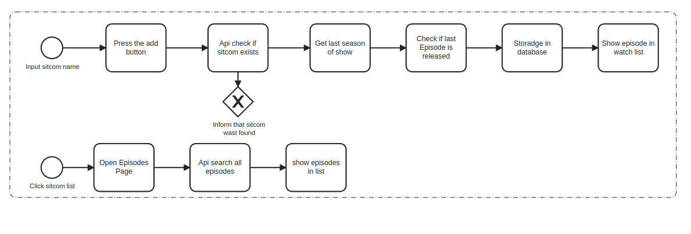

# epguides_notifier_app

Epguides notifier when your favorite sitcom season becames available

## Tasks

- Daily Schedule 
- Notify App when your show has a new season
- Browse episodes with epguides API

## Flow

## Libraries and Patterns

Inspired
by [Flutterando playlist](https://www.youtube.com/playlist?list=PLlBnICoI-g-d-v_fWlkZX2HRgHHPnJx9s)

- Clean Architecture
- Modular (dependency injection)
- BLoC (pattern state management)
- Dartz (functional programing)
- RxDart (Streams manipulation, for debouncing request events)
- SharedPreferences (Local cacheable database)
- Dio (Http Client)
- Mocktail (Unit tests, Fixtures and Mocks)

<!-- [//]: # (Recomended by BV)

- GetIt (dependency injection)
- Mobx (pattern state management) -->
